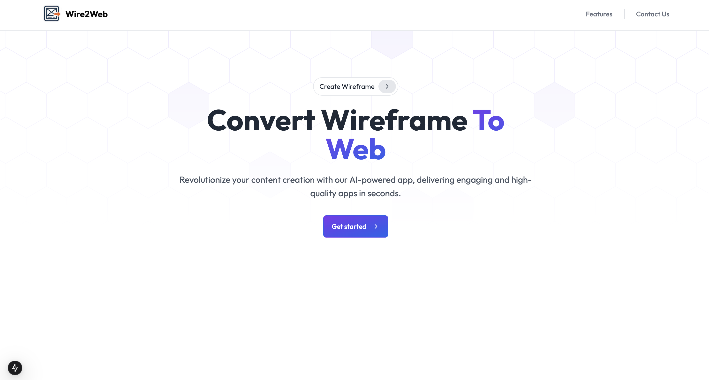
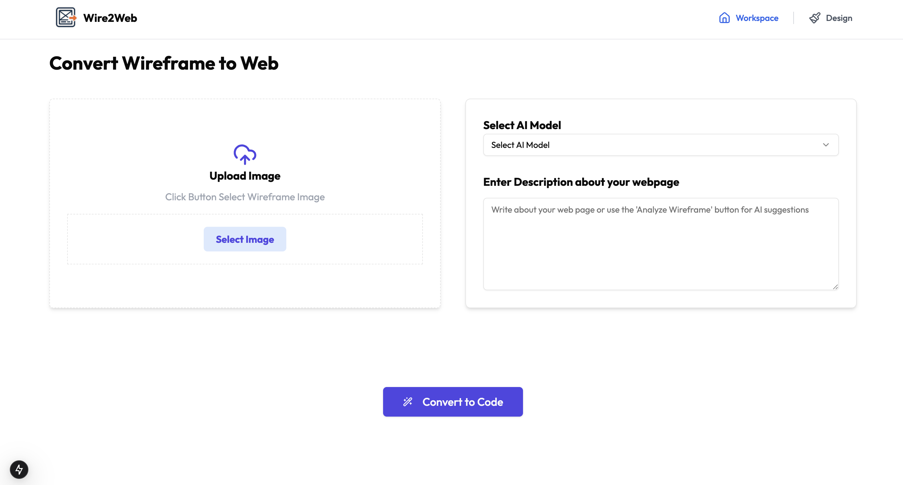

# Wire2Web - AI-Powered Wireframe to Code Converter

**Description:**  
Wire2Web is an AI-driven platform that converts wireframe designs into functional code. It allows designers and developers to quickly transform mockups and UI sketches into React components with Tailwind CSS. With an intuitive interface and powerful AI capabilities, Wire2Web streamlines the development process by generating high-quality, responsive code that matches your wireframe design.

---

## Table of Contents

- [Features](#features)
- [Technologies Used](#technologies-used)
- [Installation](#installation)
- [Running the Project](#running-the-project)
- [Environment Variables](#environment-variables)
- [Project Structure](#project-structure)
- [Deployment](#deployment)

---

## Features

### 🔹 1. Wireframe to Code Conversion

- **Upload UI wireframes** as images directly to the platform
- **AI-powered code generation** that converts wireframes to React & Tailwind CSS code
- **Multiple AI models** support including Google Gemini, Meta Llama, and Deepseek
- **Real-time code preview** with Sandpack integration
- **Customizable descriptions** to guide the AI toward your specific requirements
- Support for **responsive designs** that work across different screen sizes
- **Modern UI components** generation with proper styling

### 🔹 2. Design Management

- **Save and organize** your wireframe designs
- **View previously converted designs** in an organized gallery
- **Regenerate code** for existing designs when needed
- **Share generated code** with team members

### 🔹 3. Code Editing & Preview

- **Interactive code editor** for viewing and modifying generated code
- **Live preview** of generated UI components
- **Dependency management** for including necessary packages
- **Syntax highlighting** for better code readability
- **Export functionality** to use code in your projects

### 🔹 4. User Management

- **Firebase authentication** for secure user accounts
- **Credit system** for tracking usage
- **User dashboard** for managing designs and credits
- **Profile management** with avatar support

---

## Technologies Used

- **Frontend:**

  - Next.js 15
  - React 18
  - Tailwind CSS
  - ShadCN UI components
  - Lucide React for icons

- **Backend:**

  - Next.js API routes
  - Drizzle ORM
  - NeonDB (PostgreSQL)
  - Firebase Authentication
  - Firebase Storage

- **AI Integration:**

  - OpenAI APIs
  - Google Gemini
  - Meta Llama
  - Deepseek

- **Other Tools:**
  - TypeScript
  - Axios for HTTP requests
  - Sonner for toast notifications
  - CodeSandbox Sandpack for live code preview

---

## Installation

1. **Clone the repository:**

   ```bash
   git clone https://github.com/ishansavaliya/Wire2Web-Wireframe-to-Code-Generator.git
   ```

2. **Navigate to the project directory:**

   ```bash
   cd Wire2Web
   ```

3. **Install dependencies:**

   ```bash
   npm install
   ```

4. **Set up environment variables:**  
   Create a `.env` file in the root directory based on `.env.example`.

---

## Running the Project

### Development Mode

- Start the development server:

```bash
npm run dev
```

- Open [http://localhost:3000](http://localhost:3000) with your browser to see the result.

### Build for Production

- Build the project:

  ```bash
  npm run build
  ```

- Start the production server:
  ```bash
  npm run start
  ```

---

## Environment Variables

Create a `.env` file with the following variables:

```env
# Firebase Configuration
NEXT_PUBLIC_FIREBASE_API_KEY=
NEXT_PUBLIC_FIREBASE_AUTH_DOMAIN=
NEXT_PUBLIC_FIREBASE_PROJECT_ID=
NEXT_PUBLIC_FIREBASE_STORAGE_BUCKET=
NEXT_PUBLIC_FIREBASE_MESSAGING_SENDER_ID=
NEXT_PUBLIC_FIREBASE_APP_ID=
NEXT_PUBLIC_FIREBASE_MESURMENT_ID=

# Database Connection
NEXT_PUBLIC_NEON_DB_CONNECTION_STRING=

# AI API
OPENROUTER_AI_API_KEY=
```

---

## Project Structure

```
Wire2Web/
├── app/                     # Next.js app directory
│   ├── _components/         # Shared components
│   ├── (routes)/            # Route groups
│   │   ├── dashboard/       # Dashboard pages
│   │   ├── designs/         # Design management
│   │   └── credits/         # Credits management
│   ├── api/                 # API routes
│   │   ├── ai-model/        # AI model endpoints
│   │   ├── user/            # User management
│   │   └── wireframe-to-code/ # Wireframe conversion
│   ├── view-code/           # Code viewing pages
│   └── page.tsx             # Homepage
├── components/              # UI components
│   └── ui/                  # ShadCN UI components
├── configs/                 # Configuration files
│   ├── db.tsx               # Database configuration
│   ├── firebaseConfig.tsx   # Firebase configuration
│   └── schema.ts            # Database schema
├── context/                 # React context
├── data/                    # Data and constants
├── hooks/                   # Custom React hooks
├── lib/                     # Utility functions
└── public/                  # Static assets
```

---

## Deployment

The easiest way to deploy Wire2Web is using the [Vercel Platform](https://vercel.com/new) from the creators of Next.js.

Check out the [Next.js deployment documentation](https://nextjs.org/docs/app/building-your-application/deploying) for more details on deploying Next.js applications.

---

## Screenshots

### 1. Home Page



### 2. Dashboard


### 3. Wireframe Upload


### 4. Code Generation



---

## Contribution

### How to Contribute

We welcome contributions from the community! Here's how you can help:

1. **Fork the repository** and create your feature branch

   ```bash
   git checkout -b feature/amazing-feature
   ```

2. **Commit your changes**

   ```bash
   git commit -m 'Add some amazing feature'
   ```

3. **Push to the branch**

   ```bash
   git push origin feature/amazing-feature
   ```

4. **Open a Pull Request**

### Development Guidelines

- Follow the existing code style and architecture
- Write tests for new features when applicable
- Update documentation with any changes
- Ensure your code passes linting checks

### Bug Reports and Feature Requests

Please use the GitHub Issues tracker to report bugs or suggest features.

---
